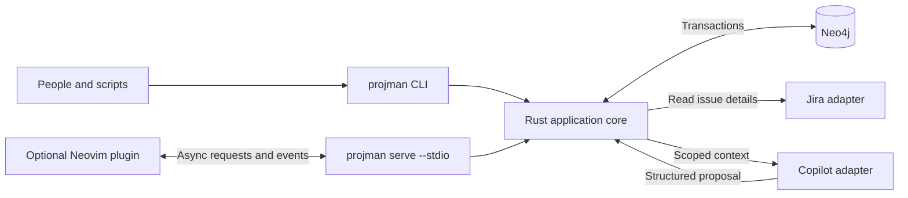

# ProjMan Neo implementation plan

This plan turns the design handoff into an implementation sequence for a personal project breakdown tool on the Arch host. A Rust core exposes the complete application through a CLI: define custom node and relationship types, create and edit instances, navigate the graph, read linked Jira issues, and review optional GitHub Copilot proposals. A Neovim plugin is one optional interface to that core.

The user confirmed personal planning, custom types, a preference for Rust, and complete CLI access on 30 September 2026. Project, Epic, Story, and Task are examples, not built-in types or a prescribed hierarchy. Other technical choices below are proposed implementation defaults. This document records the agreed plan. The initial Rust core, CLI, Neovim client, and manual proposal engine are now implemented; see the README and verification report for the current implementation and checks. Jira and Copilot integrations remain deferred for the initial build goal.

## Starting point and proposed defaults

Before this plan was added, the workspace exposed an empty README and a Neovim log, with no application implementation or project instructions found. Git metadata had not yet been initialized at that inspection. The host has Rust and Cargo 1.97.1, rustup 1.29.0, Neovim 0.12.4, and Docker 29.6.2. Node.js 22.17.0 is also available, but the application core will use Rust. No Neo4j container was running during inspection; a remote or stopped installation remains possible. Neo4j version and edition are unconfirmed.

| Decision | Plan | Status |
| --- | --- | --- |
| Audience | Personal use; concurrent CLI and editor sessions must still be safe | Confirmed |
| Type system | User-defined node properties and relationship rules from the first version | Confirmed |
| Primary interface | Full CLI for people and scripts; every application capability must be accessible here | Confirmed |
| Additional interface | Optional Lua Neovim plugin with managed buffers and navigation splits | Confirmed as one viable client |
| Core language | Rust application library and executable | User preference adopted |
| Client transport | Optional long-running stdio host within the same Rust executable | Proposed |
| Authoritative storage | Neo4j for schemas, nodes, edges, revisions, and proposal records | Proposed |
| Local files | Recovery snapshots and explicit exports; recovery never silently synchronizes changes | Proposed |
| Missing required facts | Save an incomplete node and show diagnostics | Proposed |
| Jira | Optional identity binding and read-only fetching | Proposed |
| Copilot | Optional background jobs that produce proposals for explicit review | Proposed |

Use a single logical workspace initially. Keep its internal identity distinct from any user-defined Project type. Pin exact runtime, driver, and SDK versions during setup rather than depending on moving `latest` tags. For the optional plugin, target the inspected Neovim installation first; broader editor compatibility requires separate checks.

## Architecture and ownership



The Rust application library owns schema interpretation, validation, graph invariants, revision checks, proposals, and transaction application. CLI commands and RPC handlers call the same application operations. The plugin owns editor presentation and local editing state. Adapters translate external data into explicit snapshots or proposals. Domain rules and approval enforcement must work without Neovim.

Ordinary CLI commands run directly against the application library and storage adapters; a resident daemon is not required. For editor clients, expose `projman serve --stdio` from the same binary. Use JSON request and response messages framed by newlines, with protocol version, request ID, method, and parameters; use notifications for job progress. Reserve stderr for logs. Reassemble fragmented input, enforce message size limits, and handle malformed requests. Neovim's raw job channels support this asynchronous transport and may deliver partial lines. [Neovim channel documentation](https://neovim.io/doc/user/channel/)

Independent CLI invocations and editor hosts may operate concurrently, so database coordination must work across processes. Use request timeouts, explicit job cancellation, and persisted operation IDs so reconnecting can distinguish a failed request from a committed request whose response was lost.

Proposed Rust building blocks are `clap` for commands, Serde for structured contracts, and Tokio for asynchronous IO. Keep terminal formatting and transport details outside domain logic. [clap documentation](https://docs.rs/clap/latest/clap/), [Serde documentation](https://serde.rs/), [Tokio documentation](https://tokio.rs/)

Evaluate `neo4rs` behind a repository/transaction interface in milestone 0. Its transaction API exposes execution, commit, and rollback, but compatibility, TLS, timeouts, and concurrent transaction behavior must be checked against the selected Neo4j release before adoption. Keep that choice replaceable. [neo4rs transaction API](https://docs.rs/neo4rs/latest/neo4rs/struct.Txn.html)

Use the official Copilot Rust SDK as the first integration candidate. Its current documentation includes custom permission handlers, tool filtering, event subscriptions, and cancellation, and lists Rust 1.94 or later as a prerequisite. The installed compiler meets that documented minimum; pin and check an actual release with its matching runtime in milestone 7. This is a separate transport managed by the SDK, not the editor's newline-framed protocol. [Copilot Rust SDK](https://github.com/github/copilot-sdk/blob/main/rust/README.md)

## CLI contract

The CLI is a complete product interface. Neovim may make editing more convenient, but it must not be needed to define types, perform a graph operation, inspect a conflict, or approve a proposal. Proposed command families:

| Commands | Capability |
| --- | --- |
| `projman doctor`, `config`, `workspace` | Runtime checks, configuration, workspace selection and setup |
| `projman schema validate`, `preview`, `publish`, `export`, `migrate`; `projman type list`, `show` | Author custom schemas, inspect impact, publish revisions, and migrate data |
| `projman node create`, `get`, `list`, `edit`, `update`, `archive` | Manage node instances and Markdown using files, stdin, or the configured editor |
| `projman link suggest`, `add`, `remove`, `list`, `reparent`, `reorder` | Query and change typed relationships with the same graph rules as all other clients |
| `projman search`, `outline`, `backlinks` | Navigate and inspect the graph in terminal or structured output |
| `projman export`; `projman recovery list`, `show`, `export`, `restore` | Export workspace data and recover local edits with revision checks |
| `projman change validate`, `apply`; `projman operation get` | Validate/apply a batch atomically and inspect a persisted mutation receipt |
| `projman jira bind`, `unbind`, `refresh`, `show` | Manage local bindings and read remote issue snapshots |
| `projman refine run`; `projman job list`, `show`, `cancel` | Start refinement, stream progress, inspect jobs, and request cancellation |
| `projman proposal show`, `validate`, `reject`, `apply` | Inspect proposed changes, select dependency-complete groups, and explicitly accept or reject |
| `projman serve --stdio` | Expose the same application operations to editor and future client integrations |

Support `--json` with versioned output envelopes, stable IDs, pagination, and structured errors. Human output stays readable; progress and diagnostics use stderr so stdout can be piped. Document distinct exit codes for usage, validation, conflict, unavailable dependency, missing entity, and cancellation. Accept structured input through `--file` and `--stdin`; bodies can come from a separate Markdown file. Avoid requiring shell-escaped JSON for ordinary use.

Noninteractive commands must not open an editor, block for a prompt, or silently supply approval. Updates take explicit expected revisions; patches distinguish omission from removal. A mutation accepts a reusable operation ID, while an atomic batch can combine node and link edits. `node edit` can use any configured editor, preserving its input and recovery file if a save fails. Archive preserves identity/history; permanent node deletion is deferred.

Proposal application requires the proposal ID, reviewed content digest, and exact operation/group selection. In interactive mode the CLI can display a review and collect that selection. In noninteractive mode explicit apply arguments constitute the approval action, recorded in the receipt. Neither mode may silently extend the approved selection to satisfy dependencies.

`refine run` initially remains attached and streams progress; Ctrl-C requests cancellation. Editor-hosted jobs run asynchronously. Persist job state and cancellation requests so another CLI invocation can inspect or cancel a running job; the owning process observes cancellation and aborts the SDK run. Interrupted jobs are recoverable as records, but do not promise that execution survives process exit. Detached execution can be added later without changing the core operations.

## Custom schemas come first

Start with JSON type definitions authored in any editor and validated/published through the CLI. A schema document contains node types and relationship types, so a new domain requires data definitions rather than application code changes. `schema preview` shows the impact before publication. The optional Neovim plugin adds `:ProjManTypes`, `:ProjManTypeNew`, and `:ProjManRelationTypeNew`, with managed definition buffers, completion, and diagnostics.

| Definition | Required capabilities |
| --- | --- |
| Node type | Stable ID and key, editable display name, description, ordered property definitions, display property, schema revision |
| Property | Stable key, label, value type, required flag, optional default, help text, editor hint, and constraints |
| Relationship type | Stable ID and key, source and target type sets, canonical direction, inverse label, edge properties, and graph rules |
| Graph rules | Endpoint cardinalities, duplicate policy, self-link policy, cycle policy, and optional sibling ordering |

Initial property kinds are string, integer, number, boolean, date, enum, and homogeneous scalar lists. Dates use an explicitly validated ISO date format. Relationships represent references between nodes. Limit the first version to these supported kinds while allowing arbitrary type names and property combinations; do not expose executable validators or arbitrary Cypher in type definitions.

A type chooses which string property supplies its displayed title. If that value is missing, show the type name and shortened node ID. No business field named `title`, `status`, `priority`, or `assignee` is mandatory across all types. Free Markdown text is available on every node independently of its properties.

The property array defines field order. Type defaults and explicit creation context may supply values; inherited values must be shown and editable. Changing a display label is distinct from changing a stable key.

Schemas have immutable revisions and an active workspace schema revision. Before publishing a change, preview affected nodes and relationships. Changes that invalidate existing data require an explicit migration or retention under the old schema with a visible migration-needed state. Such nodes remain readable/exportable under their recorded schema; editing requires explicit migration to the active revision. Preserve removed or unknown data in the migration review and keep local edits when reporting a schema conflict. A newly required fact must never be fabricated to complete a migration.

**First demonstration:** use only CLI commands to define two arbitrary types, such as Investigation and Deliverable, with different required properties. Define an allowed relationship between them, then create and link instances without modifying Rust or Lua. These names are fixtures only.

## Storage and transaction rules

Use stable application-generated UUID strings for node, edge, and type identity. A node records workspace ID, type ID, schema revision, content revision, structured properties, Markdown body, timestamps, and completeness. Workflow state, if needed, is an ordinary property defined by the user.

Proposed storage uses fixed internal labels such as `PMNode`, `PMTypeRevision`, and `PMWorkspace`. Store custom relationships as native edges with a stable relationship-type ID. Their editable display names do not become Cypher syntax. Map scalar custom properties to a reserved property namespace; store compound schema definitions and proposal documents as serialized JSON. Neo4j distinguishes persistable property values from constructed maps, so API objects need an explicit storage mapping. [Neo4j value types](https://neo4j.com/docs/cypher-manual/current/values-and-types/property-structural-constructed/)

Create supported uniqueness constraints for internal identities. Enforce required business properties and graph rules in the Rust core. Do not depend on Enterprise-only existence, property-type, or key constraints, and do not add existence constraints that prevent incomplete drafts. [Neo4j constraints](https://neo4j.com/docs/cypher-manual/current/schema/constraints/create-constraints/)

Proposed draft policy:

- Missing required values are permitted on save; the node is marked incomplete and the missing fields remain visible.
- Supplied values must satisfy their type and constraints. Malformed headers, unknown fields, invalid references, and invalid links reject the transaction.
- Completeness is derived from validation and kept separate from user-defined workflow status.
- Rejected saves preserve CLI input/recovery files or the full editor buffer and staged relationship changes.

All writes include the expected schema revision and relevant node revisions. For the initial personal implementation, serialize application writes using a database write lock on the workspace record. Acquire that lock before reading revisions and checking graph invariants, then validate and apply within the same transaction. This covers races across CLI and editor processes, including two individually valid links that would jointly create a cycle. Neo4j documents explicit write-lock acquisition when reads must be protected. [Neo4j concurrent data access](https://neo4j.com/docs/operations-manual/current/database-internals/concurrent-data-access/)

Increment the workspace graph revision on domain changes. Increment affected node revisions for incident edge changes as well as content changes. Use a unique operation ID and payload digest with a persisted receipt in the same transaction; a retry returns the original result and cannot apply twice. Transaction retries must contain no Jira calls, AI calls, or other external side effects.

The workspace lock is a deliberate simplicity choice for personal use. A shared service with authenticated users, narrower locking, and higher write throughput would need a later design. Direct database edits bypass application invariants and are outside the supported editing path.

## Shared relationships and navigation

Suggestions first filter by source type, destination type, direction, and graph constraints, then rank allowed choices by context or recent use. Relation-first entry restricts the destination picker. Suggestions are advisory; commit repeats validation against current data. The CLI and all clients use these same suggestion operations.

Relationship definitions choose their semantics. An outline relationship can specify ordered children, at most one parent per node, and no cycles. A prerequisite relationship can forbid cycles independently. A reference relationship need not imply either rule. Cycle checking and parent cardinality must cover all relationship types participating in the same configured hierarchy or dependency family. The user selects which eligible relationship family drives an outline; there is no hardcoded Project/Epic/Story/Task tree.

Renaming a node or type updates display text without changing references. Body mentions use stable-ID links and supply navigation/backlinks without implying a dependency. Keep body mentions distinguishable from typed planning edges. Jira parentage remains a separate imported fact; local outline moves only alter local relationships.

Persist recoverable editing snapshots under the application's XDG state directory, including base revisions and staged changes; both CLI and editor clients can list and export recoveries. Restoring a snapshot requires the ordinary validation and revision checks. Disconnection leaves cached open content editable and saves pending local recovery; the first version does not attempt automatic offline graph synchronization.

## Optional Neovim editing

The CLI already exposes these underlying operations. The plugin adds `project://<node-id>` buffers and editor navigation. Keep identity, saved revision, and schema revision in buffer metadata, with virtual text for display. The editable header contains only schema properties; the remaining text is Markdown. The core owns parsing and formatting so CLI editor input uses the same representation.

Proposed version-one serialization:

```text
--- projman
summary: "Investigate import latency"
priority: "high"
estimated_hours: 3
---
## Notes

Free Markdown, including lists, code blocks, and links.
```

This is a deliberately restricted header grammar: each property occupies one line and its value is JSON. It is not a general YAML parser. Reject duplicate keys and malformed values; parse only the opening header, leaving later Markdown delimiters alone. The formatter follows schema order, escapes strings, and preserves the body without reformatting it. The example fields belong to an example custom type.

Tab and Shift+Tab move between property values in schema order. On creation, focus the first missing required value. Mark required properties and offer enum and reference completion. Give active completion and snippet navigation precedence, provide explicit next-field commands, and preserve existing mappings outside property values.

`:write` parses a snapshot, validates it, and starts an asynchronous save. Track the buffer change counter and the staged-relationship generation at request time. On acknowledgement, advance the saved revision and clear the modified state only if the current content and staged changes still match the saved snapshot. Newer edits remain dirty. Never replace a buffer with a late response.

Neovim's `BufWriteCmd` delegates writing and successful modified-state handling to the plugin. [Neovim autocommand documentation](https://neovim.io/doc/user/autocmd/) Test pending-save quit behavior early: `:wq` must wait through a plugin continuation or refuse to close while saving; it must not report successful persistence prematurely. Timeout is an unknown outcome until its operation receipt is checked. Show a conflict comparison when another session has saved first.

Use a generated relationship split with structured rows. Add, remove, and reparent commands stage changes; the node's next save commits properties, body, and its staged edge changes atomically. Rows show direction, relationship label, destination title, and stable identity. Incoming rows provide backlink navigation using the inverse label of the same canonical edge.

## Delivery milestones

Implement the core milestones in order, then the optional clients and integrations according to the dependencies below. Each milestone has a visible result and a completion gate; there is no calendar estimate until implementation constraints are confirmed.

| Milestone | Work | Completion gate |
| --- | --- | --- |
| 0 — Rust core and CLI foundation | Establish intended Git setup; scaffold a Cargo workspace, core library, and `projman` binary; define structured IO/errors; pin and check Neo4j/driver compatibility | `projman doctor --json` reports capabilities and connection failures; a transaction can commit and roll back without an editor or daemon |
| 1 — Custom type definitions | Implement the schema meta-model, storage, CLI validation/publication, defaults, field ordering, and impact preview | Two arbitrary types and a relationship can be defined and revised from files/stdin; breaking changes identify affected data |
| 2 — Graph persistence and mutation commands | Add CLI node/link operations, uniqueness, drafts, atomic batches, revision conflicts, graph rules, and receipts | Concurrent CLI invocations cannot silently overwrite revisions, add duplicate parents, or jointly create cycles; retries are harmless |
| 3 — Complete core CLI workflow | Add generic-editor editing, input recovery, export, search, typed suggestions, backlinks, body mentions, ordered outlines, reparenting, and schema migration commands | Build and navigate a custom breakdown entirely through CLI; run the same workflow noninteractively with JSON output |
| 4 — Optional Neovim client | Add the stdio host, Lua plugin, type/node buffers, Tab navigation, completion, diagnostics, staged relation split, outline, and recovery | Repeat the CLI workflow in Neovim; delayed responses, pending quit, and concurrent CLI changes preserve edits and report conflicts |
| 5 — Optional Jira binding | Add CLI binding/refresh/show and the matching client operations; select the actual Jira adapter and enforce canonical identity | Bind and refresh issues through CLI with no remote mutation; optional Neovim views use the same snapshots |
| 6 — Proposal review engine | Add core operation groups, snapshot tracking, CLI diff/review/rejection/partial apply, and audit receipts using deterministic fixtures | CLI-only rejection leaves planning data unchanged; selected valid groups apply once; stale or incomplete selections fail |
| 7 — Copilot refinement | Pin Rust SDK/runtime; configure authentication/model; add scoped tools, CLI progress/cancellation, and proposal submission | A CLI run produces a useful review and applies only explicitly approved changes; an installed editor client can drive the same workflow |

**The first usable core release ends at milestone 3.** It works with the CLI alone. Milestone 4 adds an optional Neovim client; milestones 5 and 6 depend on the core, not on that client. Milestone 7 depends on the proposal engine; linked Jira context is included only when available. Once installed, the plugin can expose integration and review operations through the same host. Building the review engine before connecting Copilot makes approval behavior testable without relying on model output.

Proposed repository layout:

```text
Cargo.toml                       Cargo workspace
Cargo.lock                       reproducible application dependencies
crates/projman-core/src/          domain model and application operations
crates/projman-cli/src/           commands, output, and optional stdio host
crates/projman-neo4j/src/         persistence and transaction adapter
crates/projman-jira/src/          optional Jira adapter
crates/projman-copilot/src/       optional Copilot adapter
nvim/lua/projman/                plugin, transport, buffers, navigation, review
nvim/plugin/projman.lua          editor commands and startup registration
schemas/                        schema meta-model and optional examples
tests/                          CLI, database, protocol, and Neovim coverage
infra/                          pinned local Neo4j development configuration
docs/                           plan, CLI/protocol contracts, and setup
```

Keep the core crate independent of CLI, Lua, and adapter implementations. Define storage and refinement interfaces in the core, implement them in adapters, and compose them in the executable. Prefer optional features for external integrations so the graph CLI can build and run without Copilot configuration.

## Jira binding details

Binding is optional for any compatible custom type. Configure mappings to the site's issue types; do not infer them from local type names. Store Jira instance identity, issue ID, display key, browser URL, and last fetched timestamp separately from the application node ID. Enforce one canonical local node per instance/issue pair across the local graph.

Start with user-entered issue key or URL, resolve identity, then fetch a bounded set of fields. Retain a typed Jira snapshot separate from local properties and Markdown. Show its fetched time and fetch failures. Local planning status and imported Jira execution status remain distinct. Explicit field mappings can be considered later.

Cloud versus Data Center, authentication, custom fields, and issue hierarchy need the actual Jira instance before adapter implementation. The Cloud issues API exposes issue retrieval, but it does not settle those installation-specific choices. [Jira Cloud issues API](https://developer.atlassian.com/cloud/jira/platform/rest/v3/api-group-issues/)

Handle authentication failures, missing permissions, missing issues, rate limits, and unavailable servers without losing the binding or local work. A Jira create/update workflow requires a separate concrete review and is deferred beyond this plan's first integration.

## Refinement and approval details

The core captures the selected saved node, active schema, relevant neighbors, Jira snapshot, and explicitly selected repository context. Require saving or explicitly including a local draft before using unsaved content. Record every context read and its revision or content hash; bound neighborhood depth and total context size. The CLI and editor host call the same capture operation.

Initially give Copilot only application tools for reading scoped nodes, neighborhoods, schema, the captured Jira snapshot, selected repository content, and submitting a proposal. Configure available tools and permissions explicitly, deny unexpected operations, and isolate inherited credentials/configuration from the refinement runtime. Shell execution, invoking the mutation CLI, graph mutation, Jira publication, and arbitrary filesystem writes are outside this tool set. Verify effective permissions for the pinned SDK/runtime rather than assuming custom tools disable built-in capabilities. The Rust SDK documents permission handlers and tool filtering; their exact contract must be checked against the selected release. [Copilot Rust SDK](https://github.com/github/copilot-sdk/blob/main/rust/README.md)

Proposals contain an ID, immutable content digest, base schema and graph revisions, read-set revisions, operation IDs, coherent groups, dependencies, rationale, and unresolved questions. Initial operations cover node creation, property edits, body replacement, and edge additions/removals. Arbitrary schema changes and node deletion are outside the initial proposal operation set.

The CLI review shows text diffs and explicit graph changes, with an equivalent JSON representation. Optional Neovim review buffers present the same data. Selecting a group exposes all dependencies; the user must review and select the complete dependency set. Never silently apply dependent operations that were not part of the reviewed selection. Revalidate the resulting selected graph, including completeness, endpoint rules, cardinality, duplicates, and cycles.

Bind approval to the proposal digest and exact operation set. Apply under the same transaction lock used by manual editing, rechecking the schema, recorded revisions, and proposal state. Initially, any domain graph change since capture marks a proposal stale; this conservative rule can later narrow to a proven complete read set. Stale proposals require reconciliation and a fresh review.

Apply the approved subset atomically and record its receipt, previous values, resulting revisions, and approval selection in the same transaction. Rejection changes only proposal metadata, leaving planning nodes and links unchanged. Repeated acceptance cannot apply twice. Partial acceptance creates a terminal result for that selection; any remaining suggestions need a refreshed proposal.

Use explicit job states: queued, running, reviewable, failed, and cancelled, with a recorded cancellation request while shutdown is in progress. Keep proposal states separate: pending, applied, rejected, and stale. Worker ownership and heartbeat expiry identify interrupted jobs across CLI/editor process exits. Cancellation prevents late job output from entering review; it cannot retroactively undo an already committed approval transaction. A committed receipt determines the outcome if cancellation races with application.

Store mutation history sufficient to create a reviewed compensating change. Normal Neovim undo edits the current buffer; it does not silently reverse persisted graph operations. A generalized graph undo interface follows the initial release.

## Verification and release acceptance

Implementation includes focused tests at each milestone. The current build and verification commands are documented in the README; the verification report records the evidence from the initial implementation.

| Area | Evidence required before completion |
| --- | --- |
| CLI completeness | Full schema-to-graph workflow with Neovim absent; file/stdin inputs, JSON envelopes, pagination, exit codes, noninteractive operation, revision conflicts, and recovery |
| Custom schemas | Arbitrary names, different property sets, reordered fields, defaults, renamed labels, invalid definitions, and breaking-change previews |
| Parsing and editing | Header/body round trips, Unicode and escaped values, required-field order, normal Tab behavior outside properties, and malformed header diagnostics |
| Database behavior | Real transactions against the pinned Neo4j edition; simultaneous node saves, competing parents, competing cycle-closing edges, uniqueness, rollback, and repeated operation IDs |
| Client parity | CLI and stdio requests return the same validation outcomes and apply through the same transaction path |
| Asynchronous editor behavior | Headless Neovim tests with delayed/failing host responses; edits during save, pending quit, reconnect, conflict display, and recovery snapshot restoration |
| Navigation | Stable-ID links survive renames; typed suggestions respect both endpoints; backlinks show canonical inverse meaning; ordering persists |
| Jira | Adapter fixtures for duplicate binding, key changes, stale snapshots, authentication errors, and rate limits; opt-in read-only check against the configured instance |
| Proposal application | Reject, accept, partial selection, missing dependencies, stale schema/read set, duplicate acceptance, atomic failure, restart, and cancellation races |
| Copilot boundary | Unexpected tool/permission requests are denied; scoped reads stay within context; a job cannot mutate planning data before approval |

Finish the core release with a CLI-only walkthrough: define custom types, create an incomplete node, update required values and free text, add allowed links, inspect an outline and backlinks, and provoke a revision conflict. Repeat it through an optional Neovim client to check property navigation and editing behavior. Integration acceptance adds CLI Jira binding plus rejecting one refinement proposal and accepting a valid dependency-complete subset of another.

## Decisions to resolve at the relevant milestone

Personal use, custom types, Rust preference, and full CLI access are confirmed. The remaining architecture and behavior above are proposed defaults that make the work concrete.

| When | Decision | Working position |
| --- | --- | --- |
| Before milestone 0 | Neo4j instance, version, edition, persistence, and intended Git repository | Select an existing instance if suitable; otherwise pin a local Community deployment |
| Before milestone 1 | First real custom type definitions, required facts, and relationship meanings | Build the generic type system; use arbitrary fixtures until real definitions are supplied |
| Before milestone 2 | Incomplete-save behavior and archive semantics | Save missing facts as incomplete; archive preserves identity and links |
| Before milestone 3 | Editor interchange format and outline family | JSON-valued property header plus Markdown; user-selected ordered, acyclic relation family with at most one parent |
| Before milestone 5 | Jira deployment, authentication, fields, and type mapping | Read-only adapter for the actual instance |
| Before milestone 7 | Copilot authentication, available model, Rust SDK/runtime version, and allowed repository context | Explicit configuration and scoped context; no hardcoded model |

Team collaboration, automatic offline synchronization, graphical canvas, multiple primary types/inheritance, bidirectional Jira synchronization, and generalized graph undo are later work. They are not prerequisites for the personal custom-type workflow.
